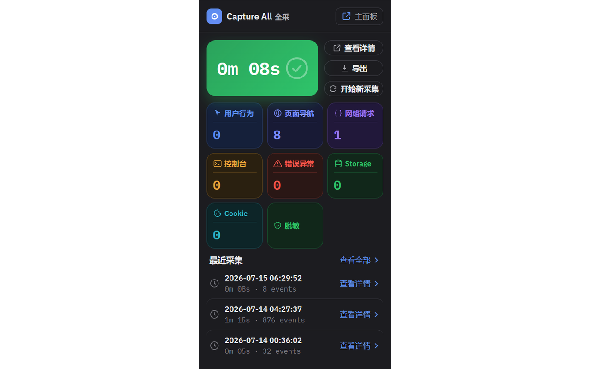
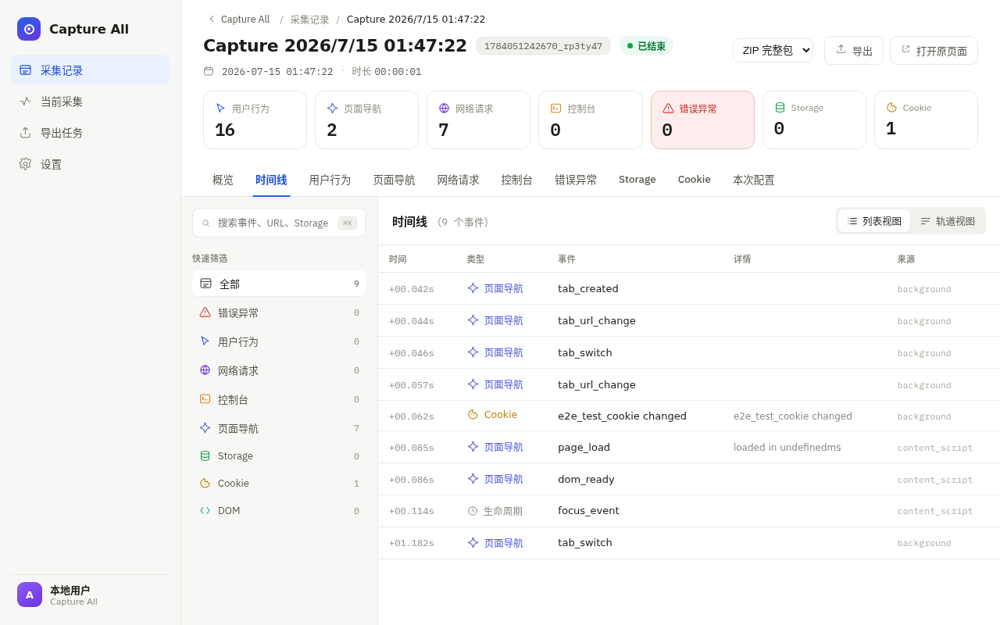
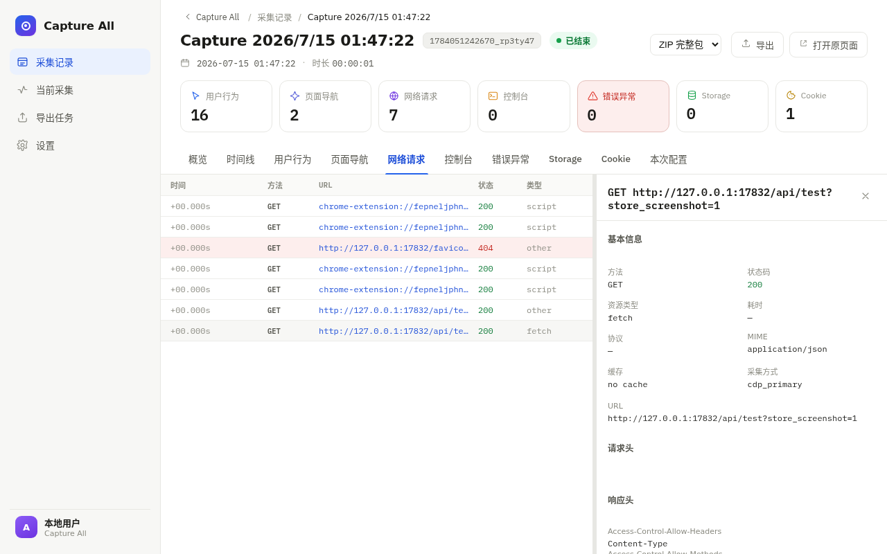
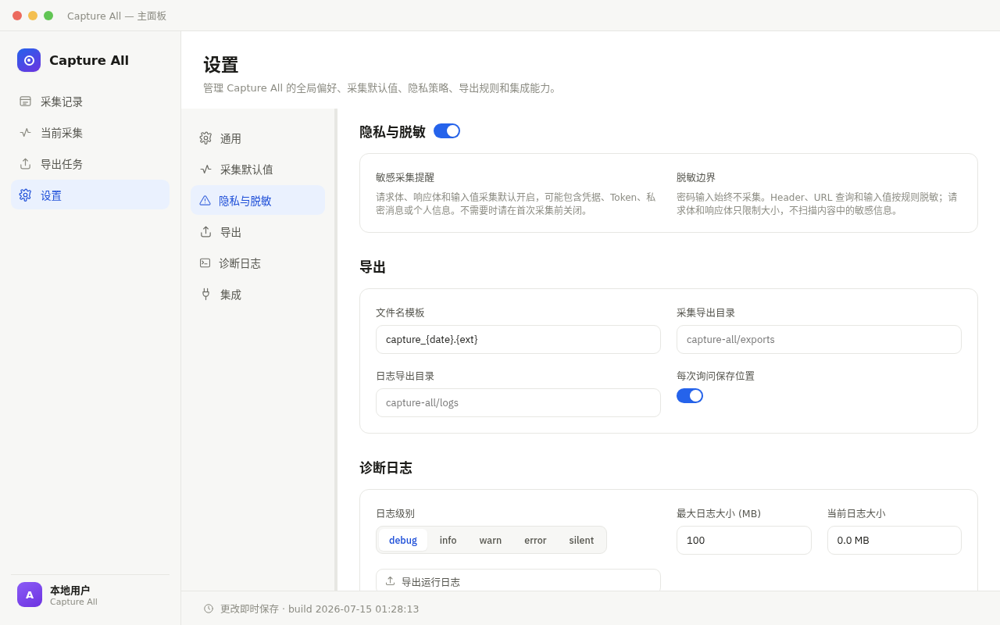

<div align="center">
  
  <h1>Capture All</h1>
  <p><strong>Local-first browser debugging black box for developers and AI Agents.</strong></p>
  <p>Capture browser evidence, visualize and inspect, export files, or query via MCP.</p>
  <p>
    <a href="README.md">简体中文</a> ·
    <a href="docs/guides/mcp_usage.md">MCP Guide</a> ·
    <a href="PRIVACY.md">Privacy</a> ·
    <a href="SECURITY.md">Security</a>
  </p>
  <p>
    <a href="https://github.com/TuTouPower/capture_all/actions/workflows/ci.yml"></a>
    <a href="LICENSE"></a>
    
  </p>
</div>

Capture All is a Chrome Manifest V3 extension that turns browser activity into local structured evidence, capturing user behavior, page navigation, network requests, console output, runtime exceptions, storage changes, and cookie changes on a single timeline.

Visualize and inspect via popup, main panel, and DevTools panel. For deeper analysis, connect the authorized local Bridge to an MCP client such as Claude Code, and let an AI Agent control capture, query individual records, or export results.

> [!WARNING]
> Capture All requests high-impact browser permissions and may capture sensitive page content. Use only on browsers, profiles, and sites you are authorized to inspect. Read [Permissions, privacy, and security](#permissions-privacy-and-security) before first capture.

## What gets captured

| Data group | Examples |
|---|---|
| User behavior | Clicks, scrolls, keyboard shortcuts or keys, input changes, viewport changes |
| Page navigation | Page loads, URL changes, tab activation, visibility changes |
| Network | Request and response metadata, timing, headers, configured body |
| Console | `console.log`, `console.warn`, `console.error`, and other output |
| Errors and exceptions | Uncaught exceptions, unhandled Promise rejections |
| Storage | `localStorage`, `sessionStorage` changes |
| Cookies | Cookie creation, updates, and deletions |

## Core capabilities

- Correlate 7 browser data groups on a unified timeline.
- Inspect captures via popup, main panel, request inspector, and DevTools panel.
- Export JSON, JSONL, HTML, or HAR files.
- Control capture via MCP, and query data in pages and time ranges.
- Captured data stays in local IndexedDB by default; it only leaves extension storage on explicit export or MCP query.
- Authorize the local Bridge with a user-supplied token.
- Support redacting sensitive URL params and headers, with size limits always enforced.

## Architecture

```text
Chrome pages and iframes
        │
        ▼
Capture All extension
  ├─ Content Script           user behavior, navigation, storage
  ├─ Service Worker          network, cookies, capture lifecycle
  ├─ Chrome DevTools Protocol console, exceptions, configured body
  ├─ IndexedDB               local capture data
  └─ Popup / main panel / DevTools panel
        │ via 127.0.0.1 authorized polling
        ▼
Local Bridge
        │        ▼
MCP Server ──► Claude Code or other MCP clients
```

Bridge binds `127.0.0.1` only. The extension, Bridge, and MCP config must use the same token.

## Project status

Capture All is still early stage and has not been released to the Chrome Web Store or npm. The current install path is building from source and loading the unpacked extension. Compatibility guarantees and support SLA are not provided.

## Screenshots

| Live capture | Completed capture |
|--------------|-------------------|
|  |  |

| Timeline overview | Request inspector |
|-------------------|-------------------|
|  |  |

| Privacy settings | Export tasks |
|------------------|--------------|
|  |  |

## Browser support

| Browser | Status | Notes |
|---------|--------|-------|
| Chrome | Full support | Manifest V3, Chrome ≥ 88 |
| Edge | Full support | Chromium-based, same as Chrome |
| Firefox | **Not supported** | Firefox Remote Debugging Protocol and Service Worker extension model are incompatible with this project's CDP-based capture layer. Would require a separate implementation. |

## Install from source

### Requirements

- Chrome or Chromium that supports Manifest V3
- Node.js `^20.19.0` or `>=22.12.0`
- npm

### Build and load the extension

```bash
git clone https://github.com/TuTouPower/capture_all.git
cd capture_all
npm ci
npm run build
```

Then:

1. Open `chrome://extensions`.
2. Enable Developer mode.
3. Click "Load unpacked extension".
4. Select `artifacts/dist` in the repository.
5. Optional: pin Capture All to the toolbar to open the popup quickly.

After rebuilding, reload the extension in `chrome://extensions` if manifest or Service Worker changes do not take effect automatically.

## Basic usage

1. Open the Capture All popup.
2. Check capture options, especially input values, request bodies, and response bodies.
3. Start capture.
4. Reproduce the browser behavior under investigation.
5. Stop capture.
6. Open the capture from the popup or main panel and inspect the timeline and details.
7. Export files when portable evidence is needed.

A single capture is capped at 500 MB and 24 hours; a single body is capped at 100 MB.

## Connect Bridge and MCP (zero-config)

Capture All is zero-config by default: the extension auto-connects to Bridge, Bridge auto-generates the MCP token, and the MCP client auto-reads it. Users never have to manage tokens or pairing codes.

```bash
npm run build                  # build extension, bridge, mcp artifacts
cp .mcp.json.example .mcp.json # copy the local MCP config (gitignored)
```

Flow after that:

1. **Bridge auto-starts:** the SessionStart hook brings up the local Bridge when a Claude Code session enters this project (port 17831, loopback only). On first start Bridge generates a random MCP token and persists it to `$XDG_RUNTIME_DIR/capture-all/bridge_token` (mode 0600).
2. **Extension auto-enrolls:** load `artifacts/dist/` in Chrome; the popup enables Agent Bridge by default. The background worker polls `127.0.0.1:17831` and enrolls on first connect via the chrome-extension origin — no token or pairing code required. Bridge numbers each browser in arrival order (一, 二, 三…); override with a custom label in extension settings if you like.
3. **MCP client auto-reads the token:** the MCP server resolves the token with priority `env > Bridge-persisted file` and aligns with Bridge automatically.

```text
get_status → start_recording → reproduce the issue → stop_recording
           → list_captures → get_timeline / list_records / export_capture
```

For multiple browsers, target one with `target_label` (e.g. "一", "二", or a custom label) or `target_instance_id`; a single instance needs neither.

### Manual start / advanced

- Start Bridge manually: `node artifacts/bridge/bridge.mjs --port 17831` (`--port` is required; without `CAPTURE_ALL_BRIDGE_TOKEN` it self-generates and persists).
- To pin a token (e.g. for cross-machine deployment): `CAPTURE_ALL_BRIDGE_TOKEN='<value from openssl rand -hex 32>' node artifacts/bridge/bridge.mjs --port 17831`, then reuse the same value in extension settings and `.mcp.json`'s `env.CAPTURE_ALL_BRIDGE_TOKEN`.
- Optional pairing for cross-machine / high-security scenarios: `POST /pair/open` (requires MCP token) opens a pairing window; the extension then passes `pairing_code` on enroll for manual approval. Loopback never requires it by default.

`.mcp.json` is gitignored and must stay on the local machine. Never write real tokens into source, documentation, issue threads, or capture exports. For full tools, parameters, limits, and troubleshooting, see the [MCP usage guide](docs/guides/mcp_usage.md).

## Development

```bash
npm run dev                # Start Vite dev mode
npm test                   # Run unit and integration tests
npm run test:watch         # Run Vitest in watch mode
npm run build              # Build the extension, Bridge, and MCP artifacts
npm run test:e2e           # Run baseline headless Playwright tests
npm run test:e2e:all       # Run all Playwright projects
npm run scan:tracked-tree  # Scan tracked files for secrets and private paths
npm run bridge             # Start Bridge from TypeScript sources
npm run mcp                # Start MCP Server from TypeScript sources
```

Build outputs:

| Artifact | Path |
|---|---|
| Chrome extension | `artifacts/dist` |
| Store bundle | `artifacts/extension.zip` |
| Bridge | `artifacts/bridge/bridge.mjs` |
| MCP Server | `artifacts/mcp/mcp.mjs` |

Implementation details in [technical architecture](docs/blueprint/architecture.md), [domain model](docs/blueprint/domain.md), and [test plan](docs/guides/test.md).

## Permissions, privacy, and security

| Permission | Purpose |
|---|---|
| `storage` | Persist user config in `chrome.storage.local` |
| `webRequest` | Observe request and response metadata |
| `debugger` | Capture console, runtime exceptions, and configured body via Chrome DevTools Protocol |
| `tabs` | Query tabs and coordinate Content Script capture |
| `alarms` | Maintain capture lifecycle tasks in the MV3 Service Worker |
| `downloads` | Save locally exported files |
| `cookies` | Capture cookie changes |
| `<all_urls>` | Run declarative Content Script and observe authorized pages across origins |

Captured data lives in the extension-local IndexedDB database `capture_all_db`, with settings in `chrome.storage.local`. Capture All does not include telemetry, analytics, ad SDKs, or remote application servers.

Important boundaries:

- Input values and request/response body capture are enabled by default. Turn them off before first capture if not needed.
- `<all_urls>` and `all_frames: true` allow the Content Script to run on top-level pages and embedded third-party iframes.
- Redaction reduces exposure risk but does not guarantee removal of all credentials or personal data.
- MCP queries may forward selected capture data to the connected AI Provider or client environment.
- Exported files are standalone copies and need separate protection and deletion.
- MCP does not provide commands to delete captures or clear the database.

Delete captures from the main panel. Removing the extension or clearing extension site data deletes local extension storage. For full data practices, see [PRIVACY.md](PRIVACY.md). Read [SECURITY.md](SECURITY.md) before reporting vulnerabilities. Do not publish sensitive evidence in GitHub issues.

## Known limitations

- The current capture model requires high-impact browser permissions.
- Bridge JSON body limit is 1 MiB; extension result reply limit is 64 MiB.
- Large captures should use paginated `list_records` or local export, not rely on full-data MCP queries.
- Redaction does not scan all potential secrets inside arbitrary response body text.
- No Chrome Web Store package, npm release, compatibility guarantee, or support SLA yet.

## Contributing

Read [CONTRIBUTING.md](CONTRIBUTING.md) before making changes. Public issues and PRs must not contain unredacted captures, tokens, request bodies, private URLs, or personal browser data. Participation is governed by [CODE_OF_CONDUCT.md](CODE_OF_CONDUCT.md). Project changes are tracked in [CHANGELOG.md](CHANGELOG.md).

## License

Licensed under the [Apache-2.0 License](LICENSE).
