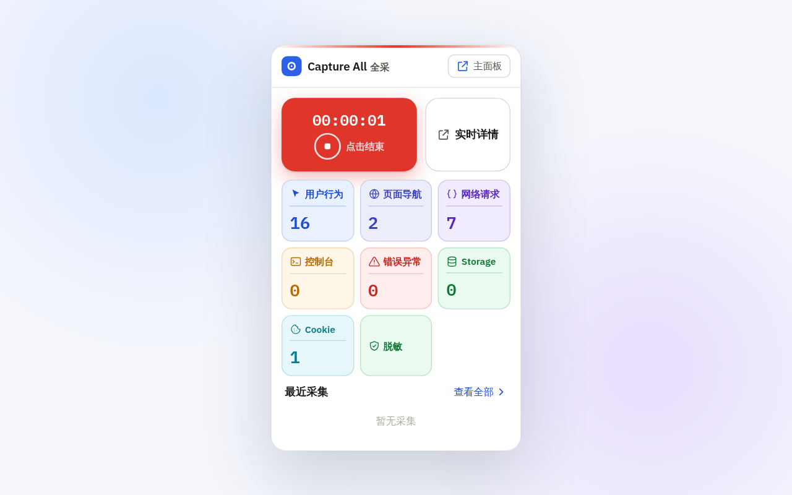
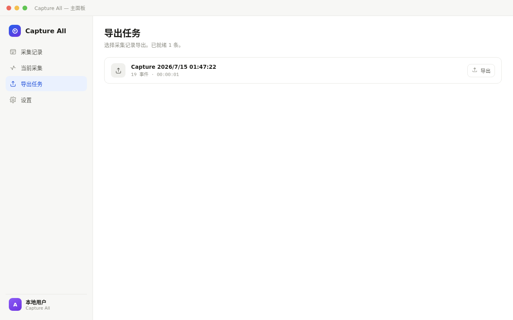

<div align="center">
  
  <h1>Capture All 全采</h1>
  <p><strong>面向开发者和 AI Agent，本地优先的浏览器调试黑盒。</strong></p>
  <p>采集浏览器证据、可视化检查、导出文件，或通过 MCP 查询。</p>
  <p>
    <a href="README.en.md">English</a> ·
    <a href="docs/mcp_usage.md">MCP 指南</a> ·
    <a href="PRIVACY.md">隐私</a> ·
    <a href="SECURITY.md">安全</a>
  </p>
  <p>
    <a href="https://github.com/TuTouPower/capture_all/actions/workflows/ci.yml"></a>
    <a href="LICENSE"></a>
    
  </p>
</div>

Capture All 是 Chrome Manifest V3 扩展，将浏览器活动转换为本地结构化证据，在同一时间线中采集用户行为、页面导航、网络请求、控制台输出、运行时异常、Storage 变更和 Cookie 变更。

可通过 popup、主面板和 DevTools 面板进行可视化检查。需要深入分析时，可将带鉴权的本地 Bridge 连接到 Claude Code 等 MCP 客户端，由 AI Agent 控制采集、查询单条数据或导出结果。

> [!WARNING]
> Capture All 申请高影响浏览器权限，可能采集页面敏感内容。仅在有权检查的浏览器、Profile 和网站中使用。首次采集前阅读[权限、隐私与安全](#权限隐私与安全)。

## 采集内容

| 数据组 | 示例 |
|---|---|
| 用户行为 | 点击、滚动、键盘快捷键或按键、输入变化、视口变化 |
| 页面导航 | 页面加载、URL 变化、标签页激活、可见性变化 |
| 网络 | 请求和响应元信息、耗时、Header、已配置的 body |
| 控制台 | `console.log`、`console.warn`、`console.error` 等输出 |
| 错误异常 | 未捕获异常、未处理的 Promise rejection |
| Storage | `localStorage`、`sessionStorage` 变更 |
| Cookie | Cookie 创建、更新和删除 |

## 核心能力

- 在统一时间线中关联 7 组浏览器数据。
- 通过 popup、主面板、请求检视器和 DevTools 面板检查采集。
- 导出 JSON、JSONL、HTML 或 HAR 文件。
- 通过 MCP 控制采集，并按分页和时间范围查询数据。
- 采集数据默认保存在本地 IndexedDB；只有主动导出或通过 MCP 查询时才会离开扩展存储。
- 使用用户提供的 Token 鉴权本地 Bridge。
- 支持敏感 URL 参数和 Header 脱敏，并始终执行大小限制。

## 架构

```text
Chrome 页面和 iframe
        │
        ▼
Capture All 扩展
  ├─ Content Script           用户行为、导航、Storage
  ├─ Service Worker           网络、Cookie、采集生命周期
  ├─ Chrome DevTools Protocol 控制台、异常、已配置的 body
  ├─ IndexedDB                本地采集数据
  └─ Popup / 主面板 / DevTools 面板
        │ 通过 127.0.0.1 鉴权轮询
        ▼
本地 Bridge
        │
        ▼
MCP Server ──► Claude Code 或其他 MCP 客户端
```

Bridge 仅绑定 `127.0.0.1`。扩展、Bridge 和 MCP 配置必须使用同一 Token。

## 项目状态

Capture All 仍处于早期阶段，尚未发布到 Chrome Web Store 或 npm。当前安装方式为从源码构建并加载已解压的扩展程序，暂不提供兼容性保证或支持 SLA。

## 截图

| 时间线总览 | 实时采集 |
|------------|---------|
|  |  |

| 请求检查器 | 隐私设置 | 导出任务 |
|-----------|---------|---------|
|  |  |  |

## 浏览器支持

| 浏览器 | 支持状态 | 说明 |
|--------|---------|------|
| Chrome | 完全支持 | Manifest V3，Chrome ≥ 88 |
| Edge | 完全支持 | 基于 Chromium，与 Chrome 一致 |
| Firefox | **不支持** | Firefox 的 DevTools Protocol、Service Worker 扩展模型与 CDP 体系不兼容，需要独立实现 |

## 从源码安装

### 环境要求

- 支持 Manifest V3 的 Chrome 或 Chromium 浏览器
- Node.js `^20.19.0` 或 `>=22.12.0`
- npm

### 构建并加载扩展

```bash
git clone https://github.com/TuTouPower/capture_all.git
cd capture_all
npm ci
npm run build
```

然后：

1. 打开 `chrome://extensions`。
2. 开启“开发者模式”。
3. 点击“加载已解压的扩展程序”。
4. 选择仓库中的 `artifacts/dist`。
5. 如需快速打开 popup，可将 Capture All 固定到工具栏。

重新构建后，如果 manifest 或 Service Worker 变化未自动生效，在 `chrome://extensions` 中重新加载扩展。

## 基础使用

1. 打开 Capture All popup。
2. 检查采集选项，尤其是输入值、请求 body 和响应 body。
3. 开始采集。
4. 复现需要调查的浏览器行为。
5. 停止采集。
6. 从 popup 或主面板打开本次采集，检查时间线和详情。
7. 需要可移植证据时导出文件。

单次采集上限为 500 MB、24 小时；单条 body 上限为 100 MB。

## 连接 Bridge 与 MCP

先构建项目，再复制仅供当前项目使用的 MCP 示例：

```bash
cp .mcp.json.example .mcp.json
```

自行生成随机 Token，并在以下三个位置使用同一值：

1. **扩展：**打开 Capture All 设置，启用 Agent Bridge，保留默认 URL `http://127.0.0.1:17831`，填写 Token。
2. **Bridge：**通过环境变量传入 Token，启动本地 Bridge。
3. **MCP 客户端：**将本地 `.mcp.json` 中的 `<YOUR_BRIDGE_TOKEN>` 替换为同一 Token。

```bash
CAPTURE_ALL_BRIDGE_TOKEN='<你的 Token>' \
    node artifacts/bridge/bridge.mjs --port 17831
```

创建 `.mcp.json` 后重启 MCP 客户端。在 Claude Code 中，常用流程为：

```text
get_status → start_recording → 复现问题 → stop_recording
           → list_captures → get_timeline / list_records / export_capture
```

`.mcp.json` 已被 Git 忽略，只能保存在本机。禁止把真实 Token 写入源码、文档、Issue 或采集导出文件。完整工具、参数、限制和故障排查见 [MCP 使用指南](docs/mcp_usage.md)。

## 开发

```bash
npm run dev                # 启动 Vite 开发模式
npm test                   # 运行单元和集成测试
npm run test:watch         # 以 watch 模式运行 Vitest
npm run build              # 构建扩展、Bridge 和 MCP 产物
npm run test:e2e           # 运行基础 headless Playwright 测试
npm run test:e2e:all       # 运行全部 Playwright 项目
npm run scan:tracked-tree  # 扫描待提交文件中的 Secret 和私有路径
npm run bridge             # 从 TypeScript 源码启动 Bridge
npm run mcp                # 从 TypeScript 源码启动 MCP Server
```

构建输出：

| 产物 | 路径 |
|---|---|
| Chrome 扩展 | `artifacts/dist` |
| 商店压缩包 | `artifacts/extension.zip` |
| Bridge | `artifacts/bridge/bridge.mjs` |
| MCP Server | `artifacts/mcp/mcp.mjs` |

实现细节见[技术架构](docs/omni_powers/op_blueprint/architecture.md)、[领域模型](docs/omni_powers/op_blueprint/domain.md)和[测试计划](docs/omni_powers/op_blueprint/test.md)。

## 权限、隐私与安全

| 权限 | 用途 |
|---|---|
| `storage` | 将用户配置存入 `chrome.storage.local` |
| `webRequest` | 观察请求和响应元信息 |
| `debugger` | 通过 Chrome DevTools Protocol 采集控制台、运行时异常和已配置的 body |
| `tabs` | 查询标签页并协调 Content Script 采集 |
| `alarms` | 维持 MV3 Service Worker 中的采集生命周期任务 |
| `downloads` | 保存本地导出文件 |
| `cookies` | 采集 Cookie 变更 |
| `<all_urls>` | 在各来源页面运行声明式 Content Script 并观察授权页面 |

采集数据保存在扩展本地 IndexedDB 数据库 `capture_all_db`，设置保存在 `chrome.storage.local`。Capture All 不包含遥测、分析、广告 SDK 或远程应用服务器。

重要边界：

- 输入值、请求 body、响应 body 采集默认开启。不需要这些数据时，应在首次采集前关闭。
- `<all_urls>` 和 `all_frames: true` 允许 Content Script 在顶层页面及嵌入式第三方 iframe 中运行。
- 脱敏只能降低暴露风险，无法保证清除所有凭据或个人信息。
- MCP 查询可能将选中的采集数据发送给所连接的 AI Provider 或客户端环境。
- 导出文件是独立副本，需要单独保护和删除。
- MCP 不提供删除采集或清空数据库命令。

通过主面板删除采集。移除扩展或清除扩展站点数据会删除本地扩展存储。完整数据规则见 [PRIVACY.md](PRIVACY.md)；报告漏洞前阅读 [SECURITY.md](SECURITY.md)。禁止在 GitHub Issue 中公开敏感证据。

## 已知限制

- 当前采集模型需要高影响浏览器权限。
- Bridge 普通 JSON body 上限为 1 MiB，扩展结果回传上限为 32 MiB。
- 大采集应使用分页 `list_records` 或扩展本地导出，不应依赖 MCP 全量数据请求。
- 脱敏不会扫描任意响应 body 文本中的所有潜在 Secret。
- 尚无 Chrome Web Store 包、npm 发布、兼容性保证或支持 SLA。

## 贡献

修改前阅读 [CONTRIBUTING.md](CONTRIBUTING.md)。公开 Issue 和 PR 禁止包含未脱敏采集、Token、请求 body、私有 URL 或个人浏览器数据。参与项目须遵守 [CODE_OF_CONDUCT.md](CODE_OF_CONDUCT.md)，项目变化记录在 [CHANGELOG.md](CHANGELOG.md)。

## License

项目使用 [Apache-2.0 License](LICENSE)。
