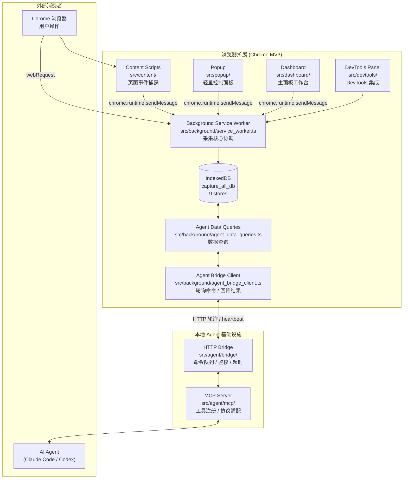

# 架构与模块设计

## 1. 架构总览

### 1.1 系统架构图



### 1.2 关键路径文件

| 文件 | 职责 |
|---|---|
| `src/background/service_worker.ts` | 扩展入口，采集生命周期管理，消息路由 |
| `src/content/content_script.ts` | Content script 入口，页面内事件分发 |
| `src/shared/types.ts` | 全部类型定义 (CaptureRecord, CaptureEvent, category/type 体系) |
| `src/shared/constants.ts` | 数据库名、Store 名、默认配置、大小限制 |
| `src/shared/i18n.ts` | 中英文国际化 |
| `src/background/storage.ts` | IndexedDB 封装 (CRUD、flush、store 路由) |
| `src/agent/bridge/main.ts` | Bridge 服务入口 |
| `src/agent/mcp/main.ts` | MCP Server 入口 |
| `src/popup/popup.ts` | Popup 控制逻辑 |
| `src/dashboard/dashboard.ts` | 主面板应用逻辑 |
| `manifest.json` | Chrome 扩展清单 |

---

## 2. 模块设计

### 2.1 目录结构

```
src/
├── background/                   # Service Worker - 采集核心
│   ├── service_worker.ts         # 主入口，消息路由，生命周期管理
│   ├── storage.ts                # IndexedDB CRUD 封装
│   ├── network_capture.ts        # webRequest / CDP 网络采集
│   ├── console_capture.ts        # CDP console 采集
│   ├── exception_capture.ts      # CDP runtime 异常采集
│   ├── cookie_capture.ts         # chrome.cookies API 采集
│   ├── body_capture_coordinator.ts # Body 捕获协调器
│   ├── network_correlator.ts     # webRequest-CDP 请求关联
│   ├── cdp_event_router.ts       # CDP 事件路由分发
│   ├── stream_buffer.ts          # SSE/流式响应增量缓冲
│   ├── external_cdp_bridge_client.ts # 外部 CDP bridge 客户端
│   ├── agent_bridge_client.ts    # Agent bridge 轮询客户端
│   ├── agent_command_dispatcher.ts # Agent 命令分发
│   ├── agent_data_queries.ts     # Agent 数据查询
│   ├── app_log_storage.ts        # 应用日志存储
│   ├── exporter.ts               # JSON/JSONL/HTML/HAR 导出
│   └── keepalive.ts              # SW 保活 (chrome.alarms)
├── content/                      # Content Scripts - 页面内采集
│   ├── content_script.ts         # 主入口，消息监听 + 按需激活
│   ├── mouse_capture.ts          # 鼠标事件
│   ├── keyboard_capture.ts       # 键盘事件
│   ├── scroll_capture.ts         # 滚动事件
│   ├── dom_capture.ts            # DOM 变化 (input_event)
│   ├── clipboard_capture.ts      # 剪贴板事件
│   ├── focus_capture.ts          # 焦点事件
│   ├── form_submit_capture.ts    # 表单提交事件
│   ├── fullscreen_capture.ts     # 全屏变化事件
│   ├── print_capture.ts          # 打印事件
│   ├── resize_capture.ts         # 窗口尺寸变化事件
│   ├── visibility_capture.ts     # 页面可见性变化事件
│   ├── storage_capture.ts        # localStorage/sessionStorage 拦截
│   ├── websocket_capture.ts      # WebSocket 帧捕获
│   └── network_hook.ts           # fetch response body hook
├── popup/                        # 弹出窗口
│   ├── popup.html                # 入口 HTML
│   ├── popup.ts                  # 控制逻辑 (3 状态切换 / 统计刷新)
│   └── popup.css                 # 样式
├── dashboard/                    # 主面板
│   ├── dashboard.html            # 入口 HTML
│   ├── dashboard.ts              # 应用逻辑 (路由 / 页面 / 数据加载)
│   ├── dashboard.css             # Shell + 基础样式
│   ├── dashboard-pages.css       # 页面级样式
│   ├── detail-shell.css          # Shell 布局
│   ├── detail-views.css          # 详情视图组件样式
│   ├── sidebar_resize.ts         # 侧边栏拖拽调整
│   └── icons.ts                  # 图标定义
├── devtools/                     # DevTools 面板
│   ├── devtools.html
│   ├── devtools_panel.html
│   ├── devtools.ts
│   └── devtools_panel.ts
├── shared/                       # 共享模块
│   ├── types.ts                  # 类型定义
│   ├── constants.ts              # 常量、默认配置
│   ├── i18n.ts                   # 国际化
│   ├── theme.ts                  # 主题
│   ├── event_utils.ts            # event_id 生成 + 公共字段填充
│   ├── event_category.ts         # 事件分类映射
│   ├── redaction.ts              # 脱敏规则
│   ├── escape.ts                 # HTML/JS 安全转义
│   ├── dom_utils.ts              # DOM 工具
│   ├── user_config.ts            # 用户配置读写
│   ├── system_time.ts            # 系统时间处理
│   ├── agent_bridge_config.ts    # Bridge 配置
│   ├── export_settings.ts        # 导出设置
│   ├── export_utils.ts           # 导出工具函数
│   ├── capture_data_reader.ts    # 采集数据读取器
│   ├── capture_stats.ts          # 采集统计计算
│   ├── poll_capture_status.ts    # 采集状态轮询
│   ├── archive_builder.ts        # 归档构建
│   ├── body_routing.ts           # Body 捕获路由
│   ├── hash.ts                   # 哈希工具
│   ├── id.ts                     # ID 生成
│   ├── logger.ts                 # 日志模块
│   └── chrome.d.ts               # Chrome API 类型声明
└── agent/                        # 本地 Agent 基础设施
    ├── bridge/
    │   ├── main.ts               # Bridge 服务入口
    │   ├── server.ts             # HTTP 服务器
    │   ├── command_queue.ts       # 命令队列
    │   ├── config.ts             # Bridge 配置
    │   └── cdp_handler.ts        # 外部 CDP 处理
    ├── mcp/
    │   ├── main.ts               # MCP Server 入口
    │   ├── client.ts             # Bridge MCP 客户端
    │   ├── schemas.ts            # Zod 参数校验 schema
    │   └── tools.ts              # 工具注册 + 命令映射
    └── shared/
        └── protocol.ts           # Agent 命令协议类型
```

### 2.2 Background Service Worker

**职责**：扩展生命周期管理、消息路由、采集协调、数据持久化。

**关键流程**：

```
startCapture(tab_id, config)
  -> 创建 CaptureRecord (mode 由 capture_mode 映射)
  -> 写入 capture_lifecycle.capture_started 事件
  -> 通知所有 content script 激活采集
  -> 初始化 CDP 采集 (按需: console / exception)
  -> 初始化 body capture coordinator
  -> 开始 agent bridge 轮询

stopCapture(capture_id)
  -> 停止所有采集模块
  -> detach CDP
  -> flush 所有未写入数据
  -> 更新 CaptureRecord status='completed'
  -> 写入 capture_lifecycle.capture_stopped 事件
```

**消息协议**：通过 `chrome.runtime.sendMessage` 在 popup/dashboard 和 SW 之间通信。

```typescript
// 请求格式
{ action: 'start' | 'stop' | 'get_status' | 'list_captures' | ... , payload: {...} }

// 响应格式
{ success: boolean, data?: {...}, error?: string }
```

### 2.3 Content Scripts

**注入策略**：`manifest.json` 声明 `content_scripts` (`matches: ["<all_urls>"]`, `run_at: "document_start"`, `all_frames: true`)。启动后仅注册消息监听，收到 start 消息后才激活采集。

**采集模块**：

| 模块 | 输出 event type | 采集方式 |
|---|---|---|
| mouse_capture | `mouse_event` | DOM 事件监听 |
| keyboard_capture | `keyboard_event` | DOM 事件监听 |
| scroll_capture | `scroll_event` | DOM 事件监听 (rAF 节流) |
| dom_capture | `input_event` | DOM 事件监听 |
| storage_capture | `storage_change` | Storage API 拦截 |
| xhr_fetch_capture | `network_request` | XHR/fetch 原型拦截 |
| network_hook | `network_request` | fetch response clone |

**路由事件**：`content_script.ts` 同时监听 `popstate` + `hashchange` 产生 `route_change` 事件。

### 2.4 Popup (弹出窗口)

**文件**：`src/popup/popup.html`, `src/popup/popup.ts`, `src/popup/popup.css`

**设计约束**：宽度约 400px，适配 Chrome 扩展弹窗；不出现垂直滚动条；内容等比例缩放保留关键信息。

**三种状态** (操作区固定高度 108px，按钮数量变化但行高不变)：

```
状态 1: 开始采集
  header: 标题 "Capture All 全采" + 右上角 "主面板" 入口按钮
  操作区: 蓝色渐变 "开始采集" 大按钮
  标签区: 7 个数据标签卡片 (仅图标+名称，无数字，居中)
  底部: 最近采集列表

状态 2: 采集中
  header: 标题 + "主面板" 入口
  操作区: 红色计时按钮 "点击结束" + "实时详情" 白描边按钮
  标签区: 7 个数据标签卡片 (图标+名称+分隔线+实时计数)
  底部: 最近采集列表

状态 3: 采集完成
  header: 标题 + "主面板" 入口
  操作区: 绿色时长块(含勾选) + "查看详情" / "开始新采集"
  标签区: 7 个数据标签卡片 (图标+名称+分隔线+计数)
  底部: 最近采集列表
```

**标签组件 (MetricCard)**：三列网格布局 (3+3+2)，卡片高度约 64px，圆角 14px；颜色使用对应数据源浅色背景 + 主色文字 + 浅边框。

**面板按钮**：右上角 `panelBtn` 背景色与外部保持一致的白色；"查看全部"底部按钮与"查看详情"右对齐。

### 2.5 Dashboard (主面板)

**文件**：`src/dashboard/dashboard.html`, `src/dashboard/dashboard.ts`，CSS 分离为 4 个文件。

**信息架构**：

```
左侧边栏 (232px)：
  - 品牌 Logo + "Capture All"
  - 采集记录 (默认首页)
  - 当前采集
  - 导出任务
  - 设置
  - MCP 集成

右侧内容区：
  - 采集记录页：概览统计卡 + 筛选栏 + 采集列表 + 批量操作栏 + 分页
  - 采集详情页 (从列表中进入)：面包屑导航 + 7 标签统计卡 + Tab 切换 (概览/时间线/网络/控制台/Storage/Cookie/错误) + 三栏布局
  - 设置页：分组表单 (通用/采集默认值/隐私与脱敏/导出/存储/集成)
```

**采集详情页三栏布局**：

```
[左侧筛选栏]  [中间事件列表/轨道]  [右侧检视器]
   - 时间范围      - 列表视图          - 概览
   - 数据源过滤    - 轨道视图 (时间线)  - 详情 (请求/响应/堆栈)
   - 严重性过滤    - 搜索/分页         - 关联事件
```

**关键约束**：不展示历史采集分层；不展示"当前采集中"统计卡；7 数据标签统计与 Popup 口径完全一致；采集详情视图在主面板内打开，不跳转独立页面。

### 2.6 Agent / MCP 系统

#### 架构层次

```
AI Agent (Claude Code / Codex)
    | MCP 协议 (stdio / HTTP)
MCP Server (src/agent/mcp/)
    | HTTP POST /mcp/command
HTTP Bridge (src/agent/bridge/)  -- 监听 127.0.0.1
    | HTTP 轮询 GET /extension/command + POST /extension/result
Agent Bridge Client (src/background/agent_bridge_client.ts)
    | 内部调用
Agent Data Queries (src/background/agent_data_queries.ts)
    | IndexedDB 读取
扩展数据库
```

#### Bridge HTTP 协议

| 端点 | 方法 | 发起方 | 用途 |
|---|---|---|---|
| `/mcp/command` | POST | MCP Server | 发送命令 |
| `/extension/command` | GET | 扩展 | 轮询获取命令 |
| `/extension/result` | POST | 扩展 | 回传结果 |
| `/extension/heartbeat` | POST | 扩展 | 在线状态 |
| `/health` | GET | 任意 | 健康检查 |
| `/cdp/detect` | POST | 扩展 | 探测外部 CDP 端口 |
| `/cdp/start` | POST | 扩展 | 启动外部 CDP 采集 |
| `/cdp/stop` | POST | 扩展 | 停止外部 CDP 采集 |
| `/cdp/events` | GET | 扩展 | 获取外部 CDP 事件 |

#### MCP 工具列表

| 工具 | 别名 | 类型 | 说明 |
|---|---|---|---|
| `get_status` | — | 状态 | bridge 版本、扩展在线状态、活跃采集 |
| `start_recording` | — | 采集控制 | 启动采集，返回 capture_id |
| `stop_recording` | — | 采集控制 | 停止采集 |
| `list_captures` | `list_sessions` | 采集 | 列出采集记录 (分页) |
| `get_capture` | `get_session` | 采集 | 获取单次采集元信息 |
| `list_data_sources` | — | 数据源 | 列出采集中的可用的数据源及计数 |
| `list_records` | — | 数据 | 按 source 列出记录 (分页/时间过滤/排序) |
| `get_record` | — | 数据 | 获取单条完整原始记录 |
| `get_timeline` | — | 时间线 | 合并多个 source 的时间线 (分页) |
| `get_timeline_item` | — | 时间线 | 获取时间线单项完整数据 |
| `get_all_capture_data` | `get_all_session_data` | 全量 | 一次性获取 capture 完整数据 |
| `export_capture` | `export_session` | 导出 | 触发 JSON/JSONL/HTML/HAR 导出 |

#### 安全边界

- Bridge 只监听 `127.0.0.1`，不绑定 `0.0.0.0`
- 所有 API 请求必须带 token；token 由用户提供，禁止硬编码
- 端口由用户配置，禁止硬编码；不提供删除采集 或清空数据 MCP 能力
- Bridge 不存储日志、不脱敏、不摘要替代详情

#### 错误码

**Bridge 层**：`BRIDGE_UNAVAILABLE`, `EXTENSION_OFFLINE`, `COMMAND_TIMEOUT`, `TOKEN_INVALID`, `COMMAND_CANCELLED`

**扩展层**：`CAPTURE_NOT_FOUND`, `SOURCE_NOT_FOUND`, `RECORD_NOT_FOUND`, `INVALID_QUERY`, `CAPTURE_ALREADY_RUNNING`, `NO_ACTIVE_CAPTURE`, `EXPORT_FAILED`, `STORAGE_READ_FAILED`, `PAYLOAD_TOO_LARGE`

**超时策略**：查询类 30s、全量类 120s、导出类 120s、start/stop 15s。超时只返回错误，不自动降级。

#### 查询参数

大多数 list 端点支持：

| 参数 | 说明 |
|---|---|
| `offset` / `limit` | 分页 |
| `start_time` / `end_time` | 时间范围过滤 (相对采集开始的 ms) |
| `order` | `asc` 或 `desc` |
| `sources` | 按数据源过滤 (仅 timeline) |

#### 命令映射 (MCP -> Bridge)

```
get_status            -> bridge 本地状态
start_recording     -> capture.start
stop_recording      -> capture.stop
list_captures        -> captures.list   (alias: list_sessions)
get_capture          -> captures.get    (alias: get_session)
list_data_sources    -> sources.list
list_records         -> data.list
get_record           -> data.get
get_timeline         -> timeline.list
get_timeline_item    -> timeline.get
get_all_capture_data -> capture.get_all_data   (alias: get_all_session_data)
export_capture       -> capture.export   (alias: export_session)
```

### 2.7 Body Capture 三层架构

```
User starts capture with response_body enabled
    |
    v
BodyCaptureCoordinator
    |
    |-- try Extension CDP (chrome.debugger.attach)
    |       |-- success -> Extension CDP Mode
    |       |-- another_debugger_attached
    |               |-- bridge enabled/available -> External CDP Bridge Mode
    |               |-- bridge unavailable -> Fallback Hook Mode
    |
    |-- permission_denied / restricted_url / unknown -> Fallback Hook Mode
```

**捕获模式**：

| 模式 | 触发条件 | 能力 | 限制 |
|---|---|---|---|
| Extension CDP | `chrome.debugger.attach` 成功 | 完整 body 捕获 | 与 F12 互斥 |
| External CDP Bridge | attach 冲突 + bridge 可用 | 通过外部 CDP 端口捕获 | 需要 `--remote-debugging-port` |
| Fallback Hook | 以上均不可用 | fetch clone + XHR 拦截 | 不支持主文档/opaque/binary |

**BodyCaptureStatus** (每条请求的 body 状态)：
`not_enabled` | `captured` | `failed` | `too_large` | `unsupported` | `unsupported_binary` | `opaque_response` | `cdp_failed` | `fallback_unavailable` | `target_not_matched` | `permission_denied` | `partial` | `redacted`

**CDP-first 架构**（P0.41 重构）：

活跃 tab（CDP attached）的网络请求由 CDP 直接采集，不再依赖 webRequest + CDP 关联：

```
活跃 tab:
  CDP Network.requestWillBeSent → 记录 url/method/headers/request body/resource_type
  CDP Network.responseReceived  → 更新 status_code/response_headers
  CDP Network.loadingFinished   → getResponseBody → 构建完整 NetworkRequestData → emit
  webRequest                    → 跳过（避免重复）

非活跃 tab:
  webRequest                    → 创建记录（URL/headers/request body）
  响应体                        → not_enabled（无法获取）
```

优势：消除 webRequest ↔ CDP 时序竞态（P0.41 根因），页面加载时 ~98% 请求不再丢失响应体。

**capture_method 值**：
| 值 | 含义 |
|---|---|
| `cdp_primary` | CDP-first：活跃 tab 由 CDP 直接构建完整记录 |
| `web_request` | webRequest 路径：非活跃 tab，无响应体 |
| `extension_cdp` | 旧路径（保留兼容）：webRequest + CDP body 关联 |
| `external_cdp_bridge` | 外部 CDP bridge 提供响应体 |
| `fallback_hook` | fetch/XHR 拦截 fallback |

**请求关联策略**（仅非活跃 tab）：webRequest requestId 与 CDP requestId 不同，使用 `(method, normalized_url, timestamp_window_2s, status_code, resource_type)` 五元组匹配。活跃 tab 无需关联——CDP 直接构建完整记录。

**CDP 自动重试机制**（`service_worker.ts` + `network_capture.ts`）：

当采集启动时当前 tab 为受限 URL（`chrome://` / `chrome-extension://` / `about:`），CDP attach 必然失败。系统在两处自动重试：

| 触发条件 | 监听器 | 重试范围 |
|---------|--------|---------|
| 用户切换到其他 tab | `chrome.tabs.onActivated` | console / exception / body capture |
| 同一 tab 从受限 URL 跳转到普通 URL | `chrome.tabs.onUpdated` | console / exception / body capture |

重试流程：
```
1. onActivated / onUpdated 检测到非受限 URL
2. 检查各子系统是否处于非活跃状态（is_console_active / is_exception_active）
3. 调用 start_body_capture / start_console_capture / start_exception_capture
4. start_body_capture 调用 enable_response_body_capture(tab_id, already_attached)
5. enable_response_body_capture 内部：
   - 若 dbg_tab_id === null（从未 attach 成功）→ 执行 chrome.dbg.attach + Network.enable
   - 若 dbg_tab_id !== null 且 dbg_tab_id === tab_id → 直接返回 success（已 attach 到目标 tab）
   - 若 dbg_tab_id !== null 且 dbg_tab_id !== tab_id → ⚠️ 当前 guard 条件有缺陷，详见 P0.39
```

**关键状态变量**（`network_capture.ts` 模块级）：
- `dbg_tab_id: number | null` — CDP debugger 当前 attach 的 tab id，null 表示未 attach
- `dbg_attached_externally: boolean` — true 表示 debugger 由外部（console/exception capture）attach，stop 时不 detach

**约束**：
- `dbg_tab_id` 只能持有一个值，代表 debugger 只 attach 到一个 tab
- `enable_response_body_capture` 的 `already_attached` 参数指示 debugger 已由调用方 attach，只需 `Network.enable`
- 多 tab 场景下，retry 按 `tabs.onActivated` 触发顺序竞争：先成功的 tab 锁定 `dbg_tab_id`，后续 tab 的 retry 被 guard 短路

### 2.8 DevTools Panel

**文件**：`src/devtools/`

轻量入口，提供 DevTools 集成面板。设计优先级低于 Popup 和 Dashboard。
