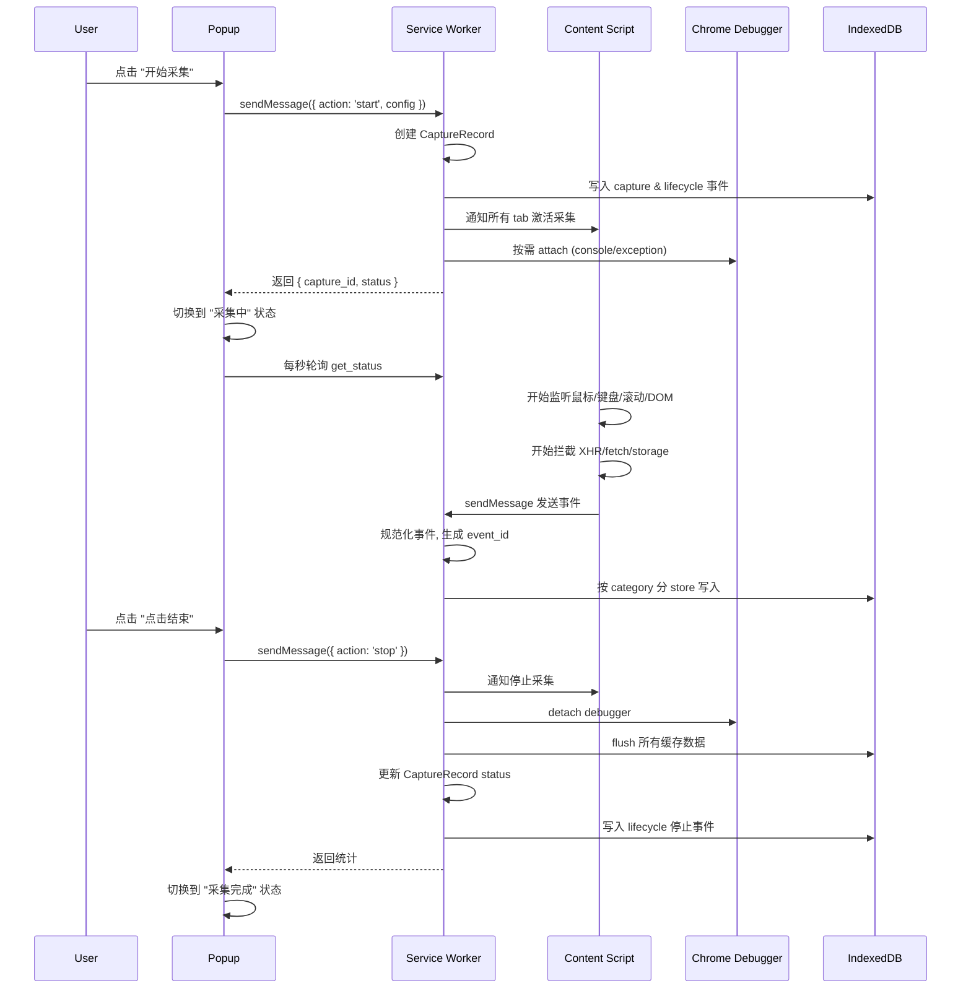
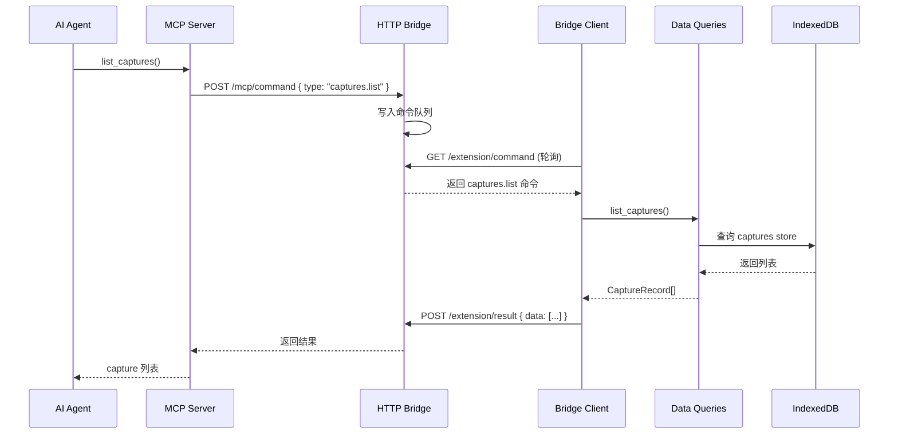
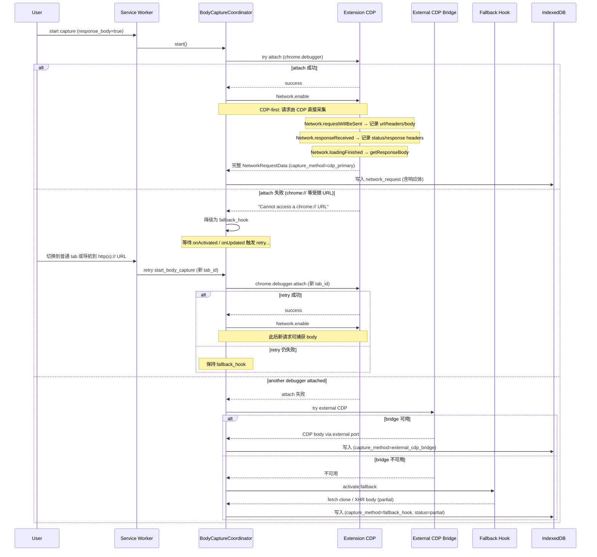

# 数据流与关键流程

## 1. 采集流程



## 2. Agent 数据读取流程



## 3. 响应体捕获流程



### 3.1 SSE / 流式 HTTP 捕获

```
responseReceived(mime=event-stream)
  → streamResourceContent(requestId)         // 首块
  → dataReceived × N (reportResourceContent) // 累积
  → [stream_buffer 节流] flush 增量写 response_body (streaming)
  → loadingFinished | capture stop
  → 强制 flush, status=captured
```

降级：`streamResourceContent` 不支持 → `dataReceived` 累积可见部分，status=partial。

### 3.2 WebSocket 帧捕获

```
webSocketCreated            → emit network_request(connecting, resource_type=websocket)
willSendHandshakeRequest    → 补 request headers
handshakeResponseReceived   → 补 response headers, status=open
frameSent/Received × N      → emit ws_frame（逐帧独立 event）
webSocketClosed             → update record(closed), 清理连接
```

帧 payload 受 `max_body_capture_bytes` 截断，超限标 `too_large`。

### 3.3 子 target（worker / iframe / OOPIF）

```
Target.setAutoAttach(flatten, waitForDebuggerOnStart)
  → attachedToTarget(sessionId)
  → register_session + Network.enable(sessionId) + runIfWaitingForDebugger
  → 该 session 的 Network/webSocket 事件复用 §3/§3.1/§3.2 逻辑
  → detachedFromTarget → unregister_session, 清理
```

M3 安全阀：stop 时先对所有 attached sessions 发 `runIfWaitingForDebugger`，防止子 target 冻结。

## 4. 数据存储流程

所有事件通过 `storage.ts` 统一写入 IndexedDB：

- **实时写入**：Content Script 发送事件 -> SW 规范化 -> 按 `category` 路由到对应 store -> 写入 IndexedDB
- **批量刷新**：flush 间隔 1000ms，批次大小 100 条
- **停止时强制刷新**：stopCapture 时 flush 所有未写入数据

事件按 store 隔离存储，查询时通过 `capture_id` 索引聚合。
