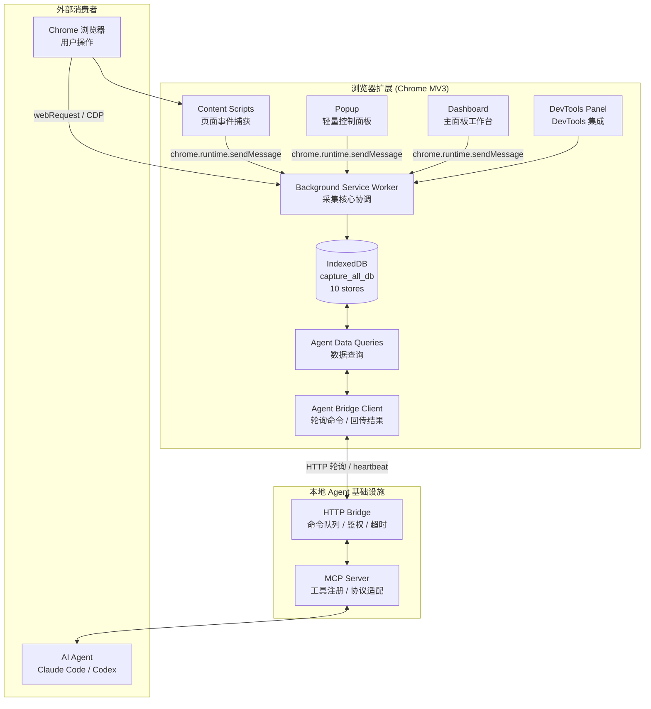

# 技术架构

技术栈、目录结构、模块职责、数据流的唯一真相源。命名规则见 `conventions.md`，术语见 `domain.md`。

## 1. 技术栈

| 层 | 技术 |
|---|---|
| 运行时 | Chrome Extension Manifest V3 |
| 语言 | TypeScript（strict mode） |
| 构建 | Vite 8 + @crxjs/vite-plugin 2.7 |
| 单元测试 | Vitest 4.x |
| E2E 测试 | Playwright 1.60 |
| Agent 协议 | MCP（@modelcontextprotocol/sdk ^1.29.0） |
| Agent 传输 | 本地 HTTP bridge（监听 127.0.0.1，Node.js + tsx） |
| 数据校验 | Zod ^4.4.3 |
| 存储 | IndexedDB（采集数据，`capture_all_db` v3）+ chrome.storage.local（用户配置） |
| 压缩 | fflate ^0.8.3 |
| 字体 | IBM Plex Sans（正文）+ IBM Plex Mono（数字/URL/代码） |
| CSS | 原生 CSS Custom Properties |
| UI 框架 | 无框架，原生 HTML/CSS/TypeScript |

构建输出 `artifacts/dist/`。遵循 Chrome Extension CSP。

## 2. 系统架构



## 3. 目录结构

按三产品 + 扁平 `shared` 组织（见 `decisions.md §002 §003`）。源码 `src/{extension,bridge,mcp,shared}`，扩展专用资源（manifest、`_locales`）随扩展入 `src/extension/`。

```
src/
├── extension/                    # Chrome 扩展产品（MV3）
│   ├── manifest.json             # 扩展清单源（构建产物仍输出到 artifacts/dist/manifest.json）
│   ├── _locales/                 # i18n 源（en / zh_CN）；构建复制到 artifacts/dist/_locales/
│   ├── background/               # Service Worker - 采集核心
│   │   ├── service_worker.ts     # 主入口，消息路由，生命周期管理
│   │   ├── storage.ts            # IndexedDB CRUD 封装（store 路由 + flush）
│   │   ├── network_capture.ts    # webRequest / CDP 网络采集
│   │   ├── network_webrequest.ts # webRequest 纯工具函数
│   │   ├── network_context.ts    # 网络上下文
│   │   ├── network_correlator.ts # webRequest-CDP 请求关联（非活跃 tab）
│   │   ├── console_capture.ts    # CDP console 采集
│   │   ├── exception_capture.ts  # CDP runtime 异常采集
│   │   ├── cookie_capture.ts     # chrome.cookies API 采集
│   │   ├── body_capture_coordinator.ts # Body 捕获协调器
│   │   ├── cdp_event_router.ts   # CDP 事件路由分发
│   │   ├── stream_buffer.ts      # SSE / 流式响应增量缓冲
│   │   ├── external_cdp_bridge_client.ts # 外部 CDP bridge 客户端
│   │   ├── agent_bridge_client.ts    # Agent bridge 轮询客户端
│   │   ├── agent_command_dispatcher.ts # Agent 命令分发
│   │   ├── agent_data_queries.ts # Agent 数据查询
│   │   ├── app_log_storage.ts    # 应用日志存储
│   │   ├── exporter.ts           # JSON / JSONL / HTML / HAR 导出
│   │   └── keepalive.ts          # SW 保活（chrome.alarms）
│   ├── content/                  # Content Scripts - 页面内采集
│   │   ├── content_script.ts     # 主入口，消息监听 + 按需激活
│   │   ├── content_event_utils.ts
│   │   ├── mouse_capture.ts / keyboard_capture.ts / scroll_capture.ts
│   │   ├── dom_capture.ts / clipboard_capture.ts / focus_capture.ts
│   │   ├── form_submit_capture.ts / fullscreen_capture.ts / print_capture.ts
│   │   ├── resize_capture.ts / visibility_capture.ts
│   │   ├── storage_capture.ts / websocket_capture.ts / network_hook.ts
│   ├── popup/                    # 弹出窗口（3 状态）
│   │   └── popup.html / popup.ts / popup.css
│   ├── dashboard/                # 主面板
│   │   ├── dashboard.html / dashboard.ts
│   │   ├── dashboard_captures.ts / dashboard_detail.ts / dashboard_settings.ts
│   │   ├── dashboard_integrations.ts / dashboard_shared.ts
│   │   ├── sidebar_resize.ts / icons.ts
│   │   └── *.css                 # Shell / pages / detail / views 样式
│   ├── devtools/                 # DevTools 面板（轻量入口）
│   │   └── devtools.html / devtools.ts / devtools_panel.html / devtools_panel.ts
│   └── shared/                   # 仅扩展专用（依赖 background/content 或扩展 UI）
│       └── capture_data_reader.ts # 直连 IndexedDB 读取采集快照（依赖 background/storage）
├── bridge/                       # Bridge 产品（HTTP 服务器 + 命令队列 + CDP）
│   ├── main.ts                   # 入口（`npm run bridge`）
│   ├── server.ts                 # HTTP 服务器（/health, /mcp/command, /extension/command …）
│   ├── command_queue.ts          # 命令队列
│   ├── config.ts                 # Bridge CLI/环境变量配置
│   └── cdp_handler.ts            # 外部 CDP 检测/启动/停止/事件
├── mcp/                          # MCP 产品（MCP Server + 工具 schema + Bridge 客户端）
│   ├── main.ts                   # 入口（`npm run mcp`）
│   ├── client.ts                 # Bridge HTTP 客户端
│   ├── schemas.ts                # Zod 参数校验 schema
│   └── tools.ts                  # MCP 工具名 → AgentCommandType 映射
└── shared/                       # 跨产品扁平共享（不依赖任何产品目录）
    ├── protocol.ts               # AgentCommandType / AgentCommandResult / AgentStatus 类型（三端线协议）
    ├── types.ts                  # 领域类型（CaptureRecord / CaptureEvent / category+type 体系）
    ├── constants.ts              # DB 名 / Store 名 / 默认配置 / 大小限制
    ├── redaction.ts              # 脱敏规则（bridge CDP 也用）
    ├── logger.ts / system_time.ts / escape.ts / hash.ts / id.ts
    ├── event_utils.ts / event_category.ts / body_routing.ts
    ├── user_config.ts / agent_bridge_config.ts
    ├── i18n.ts / theme.ts / design_tokens.css / chrome.d.ts  # 待 T006 下沉到 extension/shared
    ├── export_settings.ts / export_utils.ts                  # 待 T006 下沉到 extension/shared
    ├── archive_builder.ts / capture_stats.ts / poll_capture_status.ts / dom_utils.ts  # 待 T006
    └── …
```

依赖方向（见 `decisions.md §002`）：

```
extension ──► src/shared
bridge    ──► src/shared
mcp       ──► src/shared
extension ──✗── bridge / mcp
bridge    ──✗── extension / mcp
mcp       ──✗── extension / bridge（运行时只走 HTTP）
src/shared ──✗── 任何产品目录
```

## 4. 模块职责

### 4.1 Background Service Worker

扩展生命周期管理、消息路由、采集协调、数据持久化。详见 `specs/capture_core.md`。

消息协议（`chrome.runtime.sendMessage`）：

```typescript
// 请求
{ action: 'start' | 'stop' | 'get_status' | 'list_captures' | ... , payload: {...} }
// 响应
{ success: boolean, data?: {...}, error?: string }
```

### 4.2 Content Scripts

`manifest.json` 声明 `matches: ["<all_urls>"]`、`run_at: "document_start"`、`all_frames: true`。启动后仅注册消息监听，收到 start 消息后才激活采集。详见 `specs/content_events.md`。

### 4.3 Popup / Dashboard / DevTools

见 `specs/popup_3states.md` / `specs/dashboard.md` / `specs/devtools.md`。

### 4.4 Agent / MCP 系统

见 `specs/agent_mcp.md`。

### 4.5 Body Capture 三层架构

见 `specs/network_body_capture.md`。

## 5. 数据流

### 5.1 采集流程

```
用户点击"开始采集"
  → Popup sendMessage({ action: 'start', config })
  → SW 创建 CaptureRecord + 写 capture_started lifecycle 事件
  → SW 通知所有 tab content script 激活
  → SW 按需 attach CDP（console / exception / body）
  → SW 启动 agent bridge 轮询
  → Popup 切换"采集中"状态，每秒轮询 get_status

采集中
  → Content Script 捕获事件 → sendMessage → SW 规范化（生成 event_id）→ 按 category 路由到 store → IndexedDB
  → webRequest / CDP 捕获网络 → 脱敏 → IndexedDB
  → CDP Runtime.consoleAPICalled → console_event → console_events store
  → CDP Runtime.exceptionThrown → runtime_exception → error_events store
  → chrome.cookies.onChanged → cookie_change → cookie_changes store
  → Content Script storage hook → storage_change → storage_changes store

用户点击"点击结束"
  → Popup sendMessage({ action: 'stop' })
  → SW 通知 content script 停止
  → SW detach debugger
  → SW flush 所有未写入数据（批次 100，间隔 1000ms，停止时强制）
  → SW 更新 CaptureRecord status=completed，写 capture_stopped lifecycle
  → Popup 切换"采集完成"状态
```

### 5.2 Agent 数据读取流程

```
Agent → MCP 工具调用
  → MCP POST /mcp/command 到 Bridge
  → Bridge 写入命令队列
  → 扩展 Bridge Client 轮询 GET /extension/command 取命令
  → Client 调用 Agent Data Queries
  → Data Queries 读 IndexedDB
  → 结果 POST /extension/result 回 Bridge
  → Bridge 返回 MCP → Agent
```

### 5.3 响应体捕获流程

见 `specs/network_body_capture.md`。

## 6. Chrome 权限

`manifest.json` 声明：`storage`、`webRequest`、`debugger`、`tabs`、`alarms`、`downloads`、`cookies`；`host_permissions: ["<all_urls>"]`。`tabs` 用于读取和广播全部标签页；内容脚本通过 `content_scripts` 声明式注入，因此不需要 `activeTab` 或 `scripting`。CSP：`script-src 'self'; object-src 'self'`。

## 7. 构建产物与依赖

- 扩展输出：`artifacts/dist/`。
- Vite 多入口：background、content、popup、dashboard、devtools、devtools_panel。
- Bridge 输出：`artifacts/bridge/bridge.mjs`（esbuild 单文件，`npm run build:bridge`）。
- MCP Server 输出：`artifacts/mcp/mcp.mjs`（esbuild 单文件，`npm run build:mcp`）。
- 测试输出：`artifacts/test-results/`。

Bridge/MCP 产物为 esbuild bundled ESM，不依赖 tsx 和 node_modules，可直接 `node bridge.mjs` 运行。
MCP Server 通过 Claude Code 的 `.claude/settings.json` `mcpServers` 注册，启动后自动加载 12 个 MCP 工具。

依赖与脚本命令的完整清单见 `package.json`；测试/构建/启动命令见 `test.md`。
