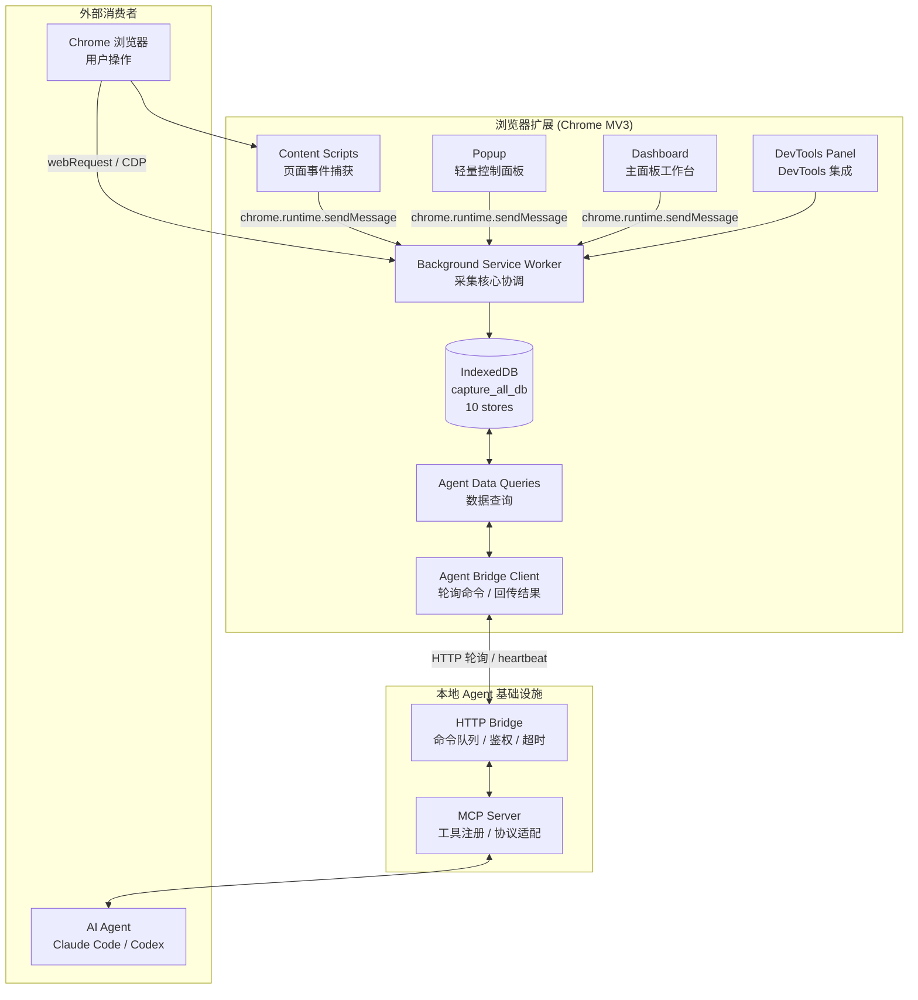

# 技术架构

技术栈、目录结构、模块职责、数据流的唯一真相源。命名规则见 `conventions.md`，术语见 `domain.md`。

## 1. 技术栈

| 层 | 技术 |
|---|---|
| 运行时 | Chrome Extension Manifest V3 |
| 语言 | TypeScript（strict mode） |
| 构建 | Vite 5 + @crxjs/vite-plugin（v2.0.0-beta.25） |
| 单元测试 | Vitest 2.x |
| E2E 测试 | Playwright 1.60 |
| Agent 协议 | MCP（@modelcontextprotocol/sdk ^1.29.0） |
| Agent 传输 | 本地 HTTP bridge（监听 127.0.0.1，Node.js + tsx） |
| 数据校验 | Zod ^4.4.3 |
| 存储 | IndexedDB（采集数据，`capture_all_db` v3）+ chrome.storage.local（用户配置） |
| 压缩 | fflate ^0.8.3 |
| 字体 | IBM Plex Sans（正文）+ IBM Plex Mono（数字/URL/代码） |
| CSS | 原生 CSS Custom Properties |
| UI 框架 | 无框架，原生 HTML/CSS/TypeScript |

构建输出 `artifacts/dist/`。遵循 Chrome Extension CSP。

## 2. 系统架构



## 3. 目录结构

```
src/
├── background/                   # Service Worker - 采集核心
│   ├── service_worker.ts         # 主入口，消息路由，生命周期管理
│   ├── storage.ts                # IndexedDB CRUD 封装（store 路由 + flush）
│   ├── network_capture.ts        # webRequest / CDP 网络采集
│   ├── network_webrequest.ts     # webRequest 纯工具函数
│   ├── network_context.ts        # 网络上下文
│   ├── network_correlator.ts     # webRequest-CDP 请求关联（非活跃 tab）
│   ├── console_capture.ts        # CDP console 采集
│   ├── exception_capture.ts      # CDP runtime 异常采集
│   ├── cookie_capture.ts         # chrome.cookies API 采集
│   ├── body_capture_coordinator.ts # Body 捕获协调器
│   ├── cdp_event_router.ts       # CDP 事件路由分发
│   ├── stream_buffer.ts          # SSE / 流式响应增量缓冲
│   ├── external_cdp_bridge_client.ts # 外部 CDP bridge 客户端
│   ├── agent_bridge_client.ts    # Agent bridge 轮询客户端
│   ├── agent_command_dispatcher.ts # Agent 命令分发
│   ├── agent_data_queries.ts     # Agent 数据查询
│   ├── app_log_storage.ts        # 应用日志存储
│   ├── exporter.ts               # JSON / JSONL / HTML / HAR 导出
│   └── keepalive.ts              # SW 保活（chrome.alarms）
├── content/                      # Content Scripts - 页面内采集
│   ├── content_script.ts         # 主入口，消息监听 + 按需激活
│   ├── content_event_utils.ts    # content 事件公共工具
│   ├── mouse_capture.ts          # 鼠标事件
│   ├── keyboard_capture.ts       # 键盘事件
│   ├── scroll_capture.ts         # 滚动事件
│   ├── dom_capture.ts            # DOM 变化（input_event / dom_mutation）
│   ├── clipboard_capture.ts      # 剪贴板事件
│   ├── focus_capture.ts          # 焦点事件
│   ├── form_submit_capture.ts    # 表单提交
│   ├── fullscreen_capture.ts     # 全屏变化
│   ├── print_capture.ts          # 打印事件
│   ├── resize_capture.ts         # 窗口尺寸变化
│   ├── visibility_capture.ts     # 页面可见性变化
│   ├── storage_capture.ts        # localStorage / sessionStorage 拦截
│   ├── websocket_capture.ts      # WebSocket 帧捕获
│   └── network_hook.ts           # fetch response body hook
├── popup/                        # 弹出窗口（3 状态）
│   ├── popup.html / popup.ts / popup.css
├── dashboard/                    # 主面板
│   ├── dashboard.html / dashboard.ts
│   ├── dashboard_captures.ts     # 采集列表页
│   ├── dashboard_detail.ts       # 采集详情页
│   ├── dashboard_settings.ts     # 设置页
│   ├── dashboard_integrations.ts # 当前采集 / 导出任务
│   ├── dashboard_shared.ts       # 共享工具
│   ├── sidebar_resize.ts         # 侧边栏拖拽
│   ├── icons.ts                  # 图标定义
│   └── *.css                     # Shell / pages / detail / views 样式
├── devtools/                     # DevTools 面板（轻量入口）
│   ├── devtools.html / devtools.ts
│   └── devtools_panel.html / devtools_panel.ts
├── shared/                       # 共享模块
│   ├── types.ts                  # 全部类型定义（CaptureRecord / CaptureEvent / category+type 体系）
│   ├── constants.ts              # DB 名 / Store 名 / 默认配置 / 大小限制
│   ├── i18n.ts / theme.ts        # 国际化 / 主题
│   ├── event_utils.ts            # event_id 生成 + 公共字段填充
│   ├── event_category.ts         # 事件分类映射
│   ├── redaction.ts              # 脱敏规则
│   ├── escape.ts                 # HTML/JS 安全转义
│   ├── dom_utils.ts              # DOM 工具
│   ├── user_config.ts            # 用户配置读写
│   ├── system_time.ts            # 系统时间处理
│   ├── agent_bridge_config.ts    # Bridge 配置
│   ├── export_settings.ts / export_utils.ts  # 导出设置与工具
│   ├── capture_data_reader.ts    # 采集数据读取器
│   ├── capture_stats.ts          # 采集统计计算
│   ├── poll_capture_status.ts    # 采集状态轮询
│   ├── archive_builder.ts        # 归档构建
│   ├── body_routing.ts           # Body 捕获路由
│   ├── hash.ts / id.ts           # 哈希 / ID 生成
│   ├── logger.ts                 # 日志模块
│   ├── design_tokens.css         # 设计令牌
│   └── chrome.d.ts               # Chrome API 类型声明
└── agent/                        # 本地 Agent 基础设施
    ├── bridge/
    │   ├── main.ts               # Bridge 服务入口
    │   ├── server.ts             # HTTP 服务器
    │   ├── command_queue.ts      # 命令队列
    │   ├── config.ts             # Bridge 配置
    │   └── cdp_handler.ts        # 外部 CDP 处理
    ├── mcp/
    │   ├── main.ts               # MCP Server 入口
    │   ├── client.ts             # Bridge MCP 客户端
    │   ├── schemas.ts            # Zod 参数校验 schema
    │   └── tools.ts              # 工具注册 + 命令映射
    └── shared/
        └── protocol.ts           # Agent 命令协议类型
```

## 4. 模块职责

### 4.1 Background Service Worker

扩展生命周期管理、消息路由、采集协调、数据持久化。详见 `specs/capture_core.md`。

消息协议（`chrome.runtime.sendMessage`）：

```typescript
// 请求
{ action: 'start' | 'stop' | 'get_status' | 'list_captures' | ... , payload: {...} }
// 响应
{ success: boolean, data?: {...}, error?: string }
```

### 4.2 Content Scripts

`manifest.json` 声明 `matches: ["<all_urls>"]`、`run_at: "document_start"`、`all_frames: true`。启动后仅注册消息监听，收到 start 消息后才激活采集。详见 `specs/content_events.md`。

### 4.3 Popup / Dashboard / DevTools

见 `specs/popup_3states.md` / `specs/dashboard.md` / `specs/devtools.md`。

### 4.4 Agent / MCP 系统

见 `specs/agent_mcp.md`。

### 4.5 Body Capture 三层架构

见 `specs/network_body_capture.md`。

## 5. 数据流

### 5.1 采集流程

```
用户点击"开始采集"
  → Popup sendMessage({ action: 'start', config })
  → SW 创建 CaptureRecord + 写 capture_started lifecycle 事件
  → SW 通知所有 tab content script 激活
  → SW 按需 attach CDP（console / exception / body）
  → SW 启动 agent bridge 轮询
  → Popup 切换"采集中"状态，每秒轮询 get_status

采集中
  → Content Script 捕获事件 → sendMessage → SW 规范化（生成 event_id）→ 按 category 路由到 store → IndexedDB
  → webRequest / CDP 捕获网络 → 脱敏 → IndexedDB
  → CDP Runtime.consoleAPICalled → console_event → console_events store
  → CDP Runtime.exceptionThrown → runtime_exception → error_events store
  → chrome.cookies.onChanged → cookie_change → cookie_changes store
  → Content Script storage hook → storage_change → storage_changes store

用户点击"点击结束"
  → Popup sendMessage({ action: 'stop' })
  → SW 通知 content script 停止
  → SW detach debugger
  → SW flush 所有未写入数据（批次 100，间隔 1000ms，停止时强制）
  → SW 更新 CaptureRecord status=completed，写 capture_stopped lifecycle
  → Popup 切换"采集完成"状态
```

### 5.2 Agent 数据读取流程

```
Agent → MCP 工具调用
  → MCP POST /mcp/command 到 Bridge
  → Bridge 写入命令队列
  → 扩展 Bridge Client 轮询 GET /extension/command 取命令
  → Client 调用 Agent Data Queries
  → Data Queries 读 IndexedDB
  → 结果 POST /extension/result 回 Bridge
  → Bridge 返回 MCP → Agent
```

### 5.3 响应体捕获流程

见 `specs/network_body_capture.md`。

## 6. Chrome 权限

`manifest.json` 声明：`storage`、`webRequest`、`debugger`、`scripting`、`tabs`、`activeTab`、`alarms`、`downloads`、`cookies`；`host_permissions: ["<all_urls>"]`。CSP：`script-src 'self'; object-src 'self'`。

## 7. 构建产物与依赖

- 构建输出：`artifacts/dist/`。
- Vite 多入口：background、content、popup、dashboard、devtools、devtools_panel。
- 测试输出：`artifacts/test-results/`。

依赖与脚本命令的完整清单见 `package.json`；测试/构建/启动命令见 `test.md`。
