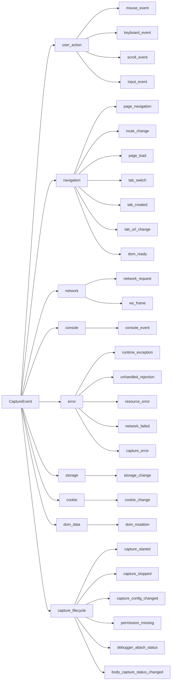

# 数据模型

## 1. CaptureRecord (采集记录)

单次采集的顶层容器，。

```typescript
interface CaptureRecord {
    capture_id: string;             // 唯一标识
    name: string;                   // 采集名称
    status: 'capturing' | 'completed';
    mode: 'standard' | 'deep' | 'custom';  // 内部模式标记
    started_at: string;             // ISO 8601
    ended_at: string | null;
    duration_ms: number;
    start_url: string;
    end_url: string | null;
    tab_id: number;
    window_id: number | null;
    config_snapshot: object;
    stats: CaptureStats;
    export_status: 'not_exported' | 'exported';
    tags: string[];
    created_at: string;
    updated_at: string;
    body_capture_mode?: BodyCaptureMode;
    body_capture_status?: BodyCaptureRuntimeStatus;
    body_capture_failure_reason?: BodyCaptureFailureReason;
}

interface CaptureStats {
    event_count: number;
    request_count: number;
    log_count: number;
    error_count: number;
    storage_change_count: number;
    cookie_change_count: number;
}
```

**mode 映射规则**：`RecordConfig.capture_mode` 是用户配置值域 `'basic' | 'advanced'`，在 startCapture 时映射为 `CaptureRecord.mode`：`'basic'` -> `'standard'`，`'advanced'` -> `'deep'`。`'custom'` 预留未来使用。

## 2. CaptureEvent (采集事件基类)

所有事件的公共基类，。

```typescript
interface CaptureEvent {
    event_id: string;               // 全局唯一 UUID
    capture_id: string;             // 所属采集
    category: CategoryKey;          // 一级分类
    type: EventType;                // 二级类型
    relative_time_ms: number;       // 相对采集开始的毫秒偏移
    absolute_time: string;          // ISO 8601 绝对时间
    tab_id: number;
    frame_id: number;
    url: string;
    top_frame_url: string | null;
    page_title: string | null;
    source: 'content_script' | 'background';
    severity: 'info' | 'warning' | 'error' | 'fatal';
    related_event_ids: string[];
    redaction_status: 'none' | 'redacted';
    raw_available: boolean;
    created_at: string;
    data?: unknown;                 // 事件特定数据载荷
}
```

## 3. 分类体系 (category + type)



**关键分离**：
- `console.error()` 通过 CDP `Runtime.consoleAPICalled` 采集 -> `console_event`（level 保留 `error`）
- 运行时异常通过 CDP `Runtime.exceptionThrown` 采集 -> `error / runtime_exception`
- Console 和 Error 在 IndexedDB 中分两个独立 store 存储

## 4. UI 数据标签 (7 个)

UI 层统一使用 7 个面向用户的数据标签，与内部 category 映射如下：

| # | UI 标签 | i18n key | 对应 category | 颜色令牌 |
|---|---------|----------|--------------|---------|
| 1 | 用户行为 | `capUser` | `user_action` | `--src-user` (#2563eb) |
| 2 | 页面导航 | `capNav` | `navigation` | `--src-nav` (#4a52d6) |
| 3 | 网络请求 | `capNet` | `network` | `--src-network` (#6d33e0) |
| 4 | 控制台 | `capConsole` | `console` | `--src-console` (#d98510) |
| 5 | 错误异常 | `capError` | `error` | `--src-error` (#e0352b) |
| 6 | Storage | `capStorage` | `storage` | `--src-storage` (#15a04a) |
| 7 | Cookie | `capCookie` | `cookie` | `--src-cookie` (#b88407) |

**说明**：UI 标签为 7 个，内部分类有 9 个（含 `dom_data` 和 `capture_lifecycle`，不在 UI 标签中展示）。脱敏是配置项，不是数据标签。

## 5. IndexedDB 存储

数据库名：`capture_all_db`，当前版本：`DB_VERSION = 2`。

| Store | keyPath | 索引 | 说明 |
|---|---|---|---|
| `captures` | `capture_id` | `started_at` | 采集记录 |
| `user_action_events` | `event_id` | `capture_id`, `type`, `relative_time_ms` | 用户操作 |
| `navigation_events` | `event_id` | `capture_id`, `relative_time_ms` | 页面导航 |
| `network_requests` | `event_id` | `capture_id`, `url`, `relative_time_ms` | 网络请求 |
| `console_events` | `event_id` | `capture_id`, `level`, `relative_time_ms` | 控制台 |
| `error_events` | `event_id` | `capture_id`, `relative_time_ms` | 运行时异常 |
| `storage_changes` | `event_id` | `capture_id`, `relative_time_ms` | Storage 变更 |
| `cookie_changes` | `event_id` | `capture_id`, `relative_time_ms` | Cookie 变更 |
| `capture_lifecycle_events` | `event_id` | `capture_id`, `relative_time_ms` | 采集生命周期 |

所有事件 store 统一使用 `event_id` (UUID) 作为 keyPath，避免复合主键 `[capture_id, relative_time_ms]` 的高频碰撞。`capture_id` 作为索引支持按采集查询。

### 存储限制

| 限制 | 值 |
|---|---|
| 单采集 大小 | 500MB |
| 单采集 时长 | 24 小时 |
| 单条 request_body | 10KB |
| 单条 response_body | 50KB |
| 单条 console arg | 1KB |
| target_text_preview | 100 字符 |
| flush 批次大小 | 100 条 |
| flush 间隔 | 1000ms |
